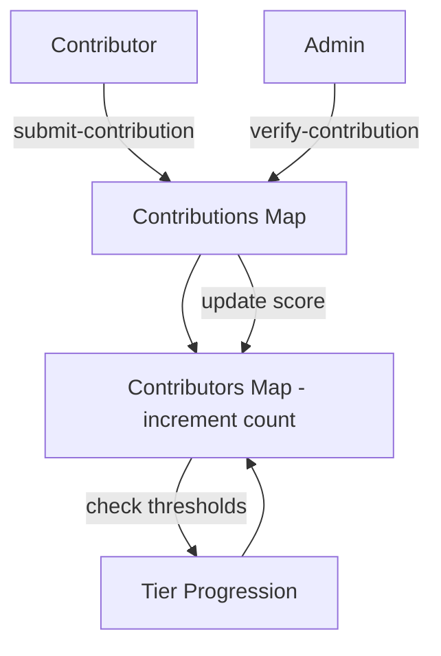

# ProofStack – Decentralized Contribution Recognition System

## Overview

**ProofStack** is a trustless reputation and contribution recognition protocol built on **Stacks**, Bitcoin’s Layer 2. It enables communities, DAOs, open-source projects, and creator collectives to **record, verify, and reward contributions transparently** without centralized gatekeepers.

Contributors own a **tamper-proof, portable reputation** that is secured by Bitcoin’s immutability and anchored to verifiable on-chain proof of work.

---

## Key Features

* **Decentralized Contribution Tracking**
  Contributors can submit work records on-chain, creating a permanent and auditable trail.

* **Verifiable Merit Scoring**
  Project admins authenticate contributions and assign merit points that influence reputation growth.

* **Tiered Reputation System**
  Automatic reputation tiers (Bronze → Silver → Gold → Platinum) incentivize ongoing contributions and provide a transparent recognition hierarchy.

* **Permissionless & Community-Driven**
  Any community can deploy and extend the protocol for their own governance or recognition system.

* **Bitcoin-Secured**
  All contribution and reputation data is anchored to Bitcoin through the Stacks blockchain.

---

## System Overview

1. **Contribution Submission**

   * A contributor submits their work description (UTF-8 string) to the protocol.
   * A unique `contribution-id` is generated for tracking.
   * The contributor’s profile is updated (or created if new).

2. **Verification & Scoring**

   * Authorized project admins verify authenticity.
   * A merit score is assigned to the contribution.
   * Contributor’s total reputation score is incremented.

3. **Tier Progression**

   * Contributors automatically progress through tiers as their cumulative score grows:

     * Bronze (default)
     * Silver (≥ 100)
     * Gold (≥ 250)
     * Platinum (≥ 500)

4. **Portable Reputation**

   * Contribution and reputation history is stored on-chain and can be queried by any application or DAO.

---

## Contract Architecture

### Constants & Error Codes

* **Reputation tiers:** Bronze → Platinum
* **Thresholds:** `100`, `250`, `500`
* **Errors:** unauthorized access, not found, already verified

### Data Structures

* **Contributors Map**
  Tracks each contributor’s profile:

  ```clarity
  {
    total-score: uint,
    contribution-count: uint,
    tier: uint,
    is-active: bool
  }
  ```

* **Contributions Map**
  Stores individual contribution records:

  ```clarity
  {
    contributor: principal,
    timestamp: uint,
    details: (string-utf8 256),
    score: uint,
    verified: bool
  }
  ```

* **Project Admins Map**
  Tracks addresses with verification privileges.

* **Contribution Counter**
  Generates unique IDs for contributions.

---

## Data Flow



---

## Public Functions

* **Administrative**

  * `initialize` → Deploy & assign first admin
  * `add-project-admin` → Grant admin rights

* **Core**

  * `submit-contribution(details)` → Submit new contribution
  * `verify-contribution(id, score)` → Verify and assign merit
  * `update-contributor-tier(contributor)` → Recalculate tier

* **Read-Only**

  * `get-contribution(id)` → Fetch contribution details
  * `get-contributor-profile(principal)` → Get contributor stats
  * `get-contributor-tier(principal)` → Query reputation tier
  * `is-project-admin(principal)` → Check admin privileges

---

## Example Usage

### Submit Contribution

```clarity
(contract-call? .proofstack submit-contribution "Built protocol documentation")
```

### Verify Contribution

```clarity
(contract-call? .proofstack verify-contribution u1 u50)
```

### Update Contributor Tier

```clarity
(contract-call? .proofstack update-contributor-tier 'ST1234...')
```

### Fetch Contributor Profile

```clarity
(contract-call? .proofstack get-contributor-profile 'ST1234...')
```

---

## Future Extensions

* **Token Rewards Integration** – link merit scores to fungible/non-fungible rewards.
* **Decentralized Admin Governance** – allow DAOs to manage verifier privileges.
* **Cross-Community Reputation Portability** – enable contributors to carry their ProofStack reputation across ecosystems.

---

## License

MIT License – open for use, modification, and community-driven extension.
